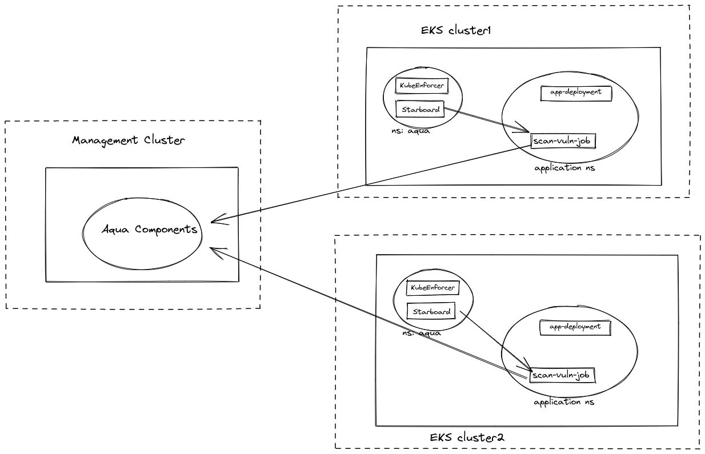

# EKS Fargate Image Scanning Installation Guide

## Description

This _prototype_ solution allows Aqua to discover and scan running container images in EKS Fargate clusters without direct access to container registries and without modifying existing/running tasks.

## Solution Overview

As part of this POC, the goal is to be able to scan running workloads images from EKS Fargate cluster. To do that we will deploy two Aqua components in customers cluster. These two component will do discovery of running workload and schedule vulnerability scan jobs in the cluster

1. Deploy Starboard and KubeEnforcer in the aqua namespace.
2. Starboard will start watching workload(deployment, daemonset, job, etc) resources in the cluster.
3. For each workload starboard will schedule scan job, which will run with container image which we want to scan. eg. if nginx:1.9.2 image running as part of nginx-deployment in prod-ns namespace, then scan job with run pod with nginx:1.9.2 in the same namespace prod-ns. 
4. Once scan gets completed, starboard will process scan result and it will delete the scan job.

  

## Prerequisites

Upload following images in ECR registry of each cluster/agent so that those **images are
accessible in any namespace of that cluster**

- aquadev.azurecr.io/scanner:starboard-static-scannercli    
- aquadev.azurecr.io/scanner:starboard-scanner-aqua
- aquadev.azurecr.io/deventest:starboard-operator-aq-plugin
- aquadev.azurecr.io/kube-enforcer:6.5.0


## Deploy KubeEnforcer using manifests

- Create Aqua namespace
  ```
  kubectl create ns aqua
  ```

**Step 1. Deploy the KubeEnforcer Config.**

-  Generate CA bundle (rootCA.crt), SSL certs (aqua_ke.key, aqua_ke.crt), and deploy the KubeEnforcer config.
        
      1. Generate certs for aqua namespace.
    ```shell
    curl -s  https://raw.githubusercontent.com/deven0t/deployments/vuln-scan-starboard/enforcers/kube_enforcer/kubernetes_and_openshift/manifests/kube_enforcer/gen_ke_certs.sh | bash
    ```

- Update following fields in the generate yaml file 001_kube_enforcer_config.yaml

    1. Update following image names in the file with your images which were prepared in prerequisites step.
        - aquadev.azurecr.io/scanner:starboard-static-scannercli    
        - aquadev.azurecr.io/scanner:starboard-scanner-aqua
        - aquadev.azurecr.io/deventest:starboard-operator-aq-plugin
    2. Create a registry integration on Aqua console UI, so that all the scanned images will be saved against that registry
        - Go to Administration->Integrations page
        - Click on Add Registries buttom from Image Registries page
        - Give convinient registry name eg fargate-cluster01
        - Select Registry Type as `API Registry for Local Scans` 
        - Click on save
    3. Update settings needed for scanner to save the result in the 001_kube_enforcer_config.yaml
        - update conole URL as `aqua.serverURL`. Update with protocol and port (line no 559)
        - Update `aqua.username` with username who has permissions to perform scan (line no 560)
        - Update `aqua.registry` with registry name which we created in previous step eg fargate-cluster01 (line no 561)
        - Create starboard secret to have password for username what we set earlier for `aqua.username`.

          ```shell
          kubectl create secret generic starboard-aqua-config -n aqua \
          --from-literal=aqua.password=<password> \
          ```

    4. Update properties required for KubeEnforcer to connect to gateway in the 001_kube_enforcer_config.yaml
        - Update AQUA_GATEWAY_SECURE_ADDRESS with gateway url and port. (line no 165)
        - Update CLUSTER_NAME with distinguishable name for each cluster. (line no 169)

- Run following command to create required configuration for aqua components

    ```shell
    kubectl apply -f 001_kube_enforcer_config.yaml
    ```

**Step 2.  Create token and SSL secrets.**

* Create enforcer group to get token from aqua console
  - Go to Administrators->Enforcers page
  - Click on `Add Enforcer Group` button
  - Select Enforcer type as Aqua KubeEnforcer
  - Give a name to group. eg eks-cluster
  - Set all option as disabled under Advanced Settings.
  - Click on create button
  - Copy the token from Clear text section

* Create the token secret.

  ```shell
  kubectl create secret generic aqua-kube-enforcer-token --from-literal=token=<token_from_server_ui> -n aqua
  ```

* Create the SSL cert secret using SSL certificates.
    
  ```shell
  kubectl create secret generic kube-enforcer-ssl --from-file aqua_ke.key --from-file aqua_ke.crt -n aqua
  ```


**Step 3. Deploy KubeEnforcer.**


- Run following command to download deployment yaml for KubeEnforcer
  ```SHELL
  wget https://raw.githubusercontent.com/deven0t/deployments/vuln-scan-starboard/enforcers/kube_enforcer/kubernetes_and_openshift/manifests/kube_enforcer/003_kube_enforcer_deploy.yaml
  ```

- Update the image name of KubeEnforcer deployment with uploaded images in prerequisite step.

- Deploy KubeEnforcer deployment with following command.

    ```shell
    kubectl apply -f 003_kube_enforcer_deploy.yaml
    ```

